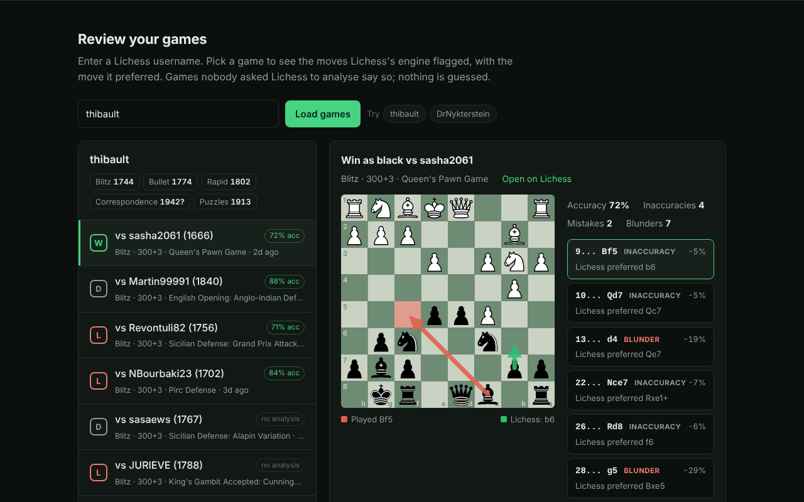

# lichess-mcp

An [MCP](https://modelcontextprotocol.io) server for [Lichess](https://lichess.org), the free, open-source chess site. MCP (Model Context Protocol) is the open standard that lets AI apps like Claude and Cursor call outside tools. This server gives them a player's profile and recent games, the mistakes Lichess's engine flagged in those games, cloud engine evaluations, exact endgame results from the tablebase, puzzles, and opening statistics.

It is built around one rule: **the model never does the chess.** Every evaluation, every "this was a mistake", every best move comes from Lichess: its server analysis of a game, its cloud evaluation cache, or its endgame tablebase. When Lichess has no answer, the tool says "not available" and tells the model not to estimate one.

No API key needed. Runs locally over stdio or as a remote server with a web playground.



## Why the model never does the chess

Language models are fluent about chess and often wrong about it. They suggest illegal moves, hang pieces, miss short tactics, and state evaluations no engine would agree with, all in the same confident tone as when they are right. For a coaching tool that is the worst kind of error, because the player has no easy way to tell.

So the work is split:

- **Lichess does the chess.** Per-move evals and inaccuracy / mistake / blunder labels come from Lichess's server analysis (Stockfish). Position evals come from the Lichess cloud cache. Positions with 7 pieces or fewer come from the Syzygy tablebase, which is perfect play.
- **The code does bookkeeping.** [chess.js](https://github.com/jhlywa/chess.js) validates FENs (the standard text format for a chess position), replays games to recover each position, and converts engine notation (`e7e5`) to normal notation (`e5`). It never judges a position.
- **The model explains.** It reads the structured results and talks to the player.
- **Missing data stays missing.** An unanalysed game, a position the cloud cache doesn't have, or a hidden puzzle solution comes back as an explicit "not available" with the next step (request analysis on Lichess, use the tablebase, open the analysis board). The server instructions and tool messages tell the model not to fill the gap itself.

## What you can ask

> Review my last blitz game as thibault. What were my worst moves?

> What does the engine say about this position? `r1bqkbnr/pppp1ppp/2n5/4p3/4P3/5N2/PPPP1PPP/RNBQKB1R w KQkq - 2 3`

> Is this king and pawn endgame a win? `4k3/8/4K3/4P3/8/8/8/8 w - - 0 1`

> Give me today's puzzle but don't tell me the answer yet.

> What do 1600-1800 blitz players play against the Sicilian after 2. Nf3? (needs a token, see below)

## Install

Requires Node.js 20 or newer. The npm package is `lichess-coach-mcp` (the name `lichess-mcp` on npm belongs to an unrelated project).

### Claude Desktop

Add this to `claude_desktop_config.json` (macOS: `~/Library/Application Support/Claude/`, Windows: `%APPDATA%\Claude\`), then restart Claude Desktop:

```json
{
  "mcpServers": {
    "lichess": {
      "command": "npx",
      "args": ["-y", "lichess-coach-mcp"]
    }
  }
}
```

To enable `opening_stats`, add `"env": { "LICHESS_TOKEN": "lip_..." }` with your own token.

### Claude Code

```bash
claude mcp add --transport stdio lichess -- npx -y lichess-coach-mcp

# with a token, available in every project:
claude mcp add --env LICHESS_TOKEN=lip_... --transport stdio --scope user lichess -- npx -y lichess-coach-mcp

# or a hosted copy of the remote server:
claude mcp add --transport http lichess https://your-host.example/mcp
```

### Cursor

Add to `~/.cursor/mcp.json` (all projects) or `.cursor/mcp.json` (this project):

```json
{
  "mcpServers": {
    "lichess": {
      "command": "npx",
      "args": ["-y", "lichess-coach-mcp"]
    }
  }
}
```

For a hosted copy, use `{ "url": "https://your-host.example/mcp" }` instead.

### From source

```bash
git clone https://github.com/frogr/lichess-mcp && cd lichess-mcp
npm install && npm run build
# then use "command": "node", "args": ["/absolute/path/to/lichess-mcp/dist/index.js"]
```

### Configuration

| Env var | Default | Purpose |
| --- | --- | --- |
| `LICHESS_TOKEN` | none | Personal API token from [lichess.org/account/oauth/token](https://lichess.org/account/oauth/token), no scopes needed. Only `opening_stats` requires it. Leave it unset otherwise: Lichess rejects every request that carries a bad token. |
| `LICHESS_TIMEOUT_MS` | `15000` (stdio), `12000` (HTTP) | Per-request timeout. |

The HTTP server has more settings (rate limits, CORS, body size); they are listed in [`.env.example`](.env.example).

## Tools

| Tool | What it does | Key inputs | Source of the chess |
| --- | --- | --- | --- |
| `get_player` | Profile: title, rating per speed with game counts and provisional flags, W/L/D totals, puzzle high scores | `username` | n/a |
| `recent_games` | Up to 20 recent finished games, read from Lichess's NDJSON export: opponent, result, opening, accuracy, and whether the game has analysis | `username`, `max`, `perf_type`, `rated` | Lichess server analysis (accuracy) |
| `get_game` | One game: players, result, opening, every move in SAN with clock time, per-move eval and judgment when analysed, clean PGN | `game_id` (id or URL), `include_pgn` | Lichess server analysis |
| `find_mistakes` | One player's flagged moves: move played, Lichess's best move and line, eval and winning chances before and after, the FEN before the move | `game_id`, `for_player` (name or white/black), `min_severity` | Lichess server analysis |
| `evaluate_position` | Cloud eval for a FEN: score, best move and line in SAN, up to 3 lines | `fen`, `multi_pv` | Lichess cloud eval |
| `tablebase` | Exact win/draw/loss for 7 pieces or fewer, distance to mate or zeroing, every move ranked | `fen` | Lichess tablebase (Syzygy) |
| `puzzle_of_the_day` | Today's puzzle: position, side to move, rating, themes, source game. Solution hidden unless `reveal_solution` | `reveal_solution` | Lichess puzzles |
| `get_puzzle` | Same, by puzzle id | `id`, `reveal_solution` | Lichess puzzles |
| `opening_stats` | Opening explorer: opening name, each next move's popularity and results, from the Lichess or Masters database | `moves` or `fen`, `database`, `speeds`, `ratings` | Lichess opening explorer (needs token) |

Every tool is marked `readOnlyHint: true` and declares an `outputSchema`. Results come back as JSON text, which works in any client, and as `structuredContent` for clients that use it.

## Design notes

**Not available is a normal answer.** Three things are often missing, and each has its own reply:

- A game nobody asked Lichess to analyse. `find_mistakes` returns `analysis_available: false`, no mistakes, and the steps to request a free analysis on Lichess. In the live check on 2026-10-07 (see [PROOF.md](PROOF.md)), 8 of thibault's 20 most recent games had no analysis.
- A position not in the cloud cache. `evaluate_position` returns `available: false`. If the position has 7 pieces or fewer it points to `tablebase`; otherwise it gives the Lichess analysis-board URL. This is common for real middlegame positions: in the same live check, 13 of 15 mistake positions were not in the cache.
- The opening explorer without a token. Lichess now requires sign-in for it, so `opening_stats` says that up front instead of failing with a bare 401.

**Puzzles are for solving.** The solution stays out of the response (not just out of the text) until `reveal_solution: true`. While hidden, there is a one-line hint naming the piece that moves first, taken from Lichess's solution, so the model can nudge without working anything out. The puzzle position is rebuilt by replaying the source game, which keeps real move numbers; the solution is then numbered from there (`14... e4 15. Nxf6+ Qxf6`).

**Bookkeeping that can't invent notation.** UCI-to-SAN conversion plays each move on a real board and stops at the first illegal move, so a malformed engine line comes back shorter, never made up. Lichess engines write castling as king-takes-rook (`e1h1`); that is translated before replay. Win chances use Lichess's own formula on Lichess's eval.

**Being polite to Lichess.** The client follows the [Lichess API tips](https://lichess.org/page/api-tips): one request at a time per host, a descriptive User-Agent, and after any 429 it stops calling that host for a full minute and says so instead of retrying. It also has timeouts, retries on 5xx with backoff, and a 60-second cache so an agent asking the same thing twice costs one request. The game export is NDJSON (one JSON object per line); it is read as a stream and the download is cancelled once enough games have arrived.

**Inputs.** Usernames, game ids, puzzle ids and enum values are checked by zod schemas before any request. A game id can also be a lichess.org URL. FENs are validated with chess.js (including Lichess's underscore URL form and missing move counters) before anything is sent. Move lists for the explorer accept SAN or UCI and name the first illegal move.

**Errors.** Upstream failures become tool errors (`isError: true`) with a hint the model can act on:

```
No Lichess game with id 'zzzzzzzz'. (HTTP 404)
Hint: Game ids are the 8 characters after lichess.org/ in the game URL. Use recent_games to list a player's games.
```

## Remote server and playground

`npm start` serves:

| Route | |
| --- | --- |
| `POST /mcp` | MCP over Streamable HTTP (official SDK), stateless, JSON responses |
| `GET /` | Web playground: enter a username to review recent games and their flagged mistakes on a board, try the puzzle of the day, and copy client configs |
| `GET /health` | Status, version, limits and whether a token is set. Never calls Lichess. |

`/mcp` is protected for public hosting: per-IP rate limit (default 30/min, token bucket), a global daily cap (default 5,000), a 64 KB body limit checked before parsing, a 30-second wall-clock limit per request, CORS with an optional allow list, and generic messages instead of stack traces. The playground page is served with a strict Content-Security-Policy and builds every element with DOM methods, so text from Lichess is never parsed as HTML.

## Deploy

**Render (free):** push the repo to GitHub, then in Render choose New > Blueprint and pick the repo. `render.yaml` sets up a free web service with `npm ci && npm run build`, `npm start`, health check on `/health`, and `TRUST_PROXY=1`. Optionally add `LICHESS_TOKEN` in the dashboard to enable `opening_stats`. Free instances sleep when idle, so the first request after a while takes a few extra seconds.

**Docker:**

```bash
docker build -t lichess-mcp . && docker run -p 3000:3000 lichess-mcp
```

**Any Node host:** `npm ci && npm run build && npm start`. Set `TRUST_PROXY` to the number of proxies in front of the app so rate limiting sees the real client IP.

Env vars: `LICHESS_TOKEN` (optional), `LICHESS_TIMEOUT_MS`, `PORT`, `HOST`, `RATE_LIMIT_PER_MINUTE`, `DAILY_REQUEST_LIMIT`, `MAX_BODY_BYTES`, `REQUEST_TIMEOUT_MS`, `CORS_ORIGINS`, `TRUST_PROXY`. Defaults are in `.env.example`.

## Development

```bash
npm install
npm test                 # vitest, recorded fixtures only, no network
npm run typecheck
npm run build
npm run smoke            # stdio: initialize + tools/list
npm run smoke:http       # HTTP: /health, CORS, initialize, tools/list, playground
node scripts/smoke.mjs --live         # also real tool calls to Lichess
node scripts/live-check.mjs thibault  # consistency check against live Lichess (see PROOF.md)
npm run screenshots      # Playwright + Chromium, live data
```

Tests run against responses recorded from the real Lichess API in `test/fixtures/` (one opening-explorer response is synthetic and labeled as such, since the explorer needs a token). A mocked `fetch` fails on any URL it doesn't know. `test/server.test.ts` drives the full MCP protocol in memory, including output-schema validation; `test/http.test.ts` runs the SDK client against a real socket.

```
src/
  index.ts         stdio entrypoint (the npx bin)
  http.ts          Node HTTP adapter for the remote server
  app.ts           routes, CORS, rate limits, size and time limits
  server.ts        tool registration and server instructions
  lichess.ts       HTTP client: per-host queue, 429 cooldown, retries, cache
  ndjson.ts        streaming NDJSON parser
  chess.ts         chess.js helpers: FEN checks, UCI to SAN, replay
  tools/           one file per tool group: zod schemas + handler
public/            playground page and piece SVGs
test/              vitest suites + fixtures/
scripts/           smoke tests, live check, screenshots
```

## Credits

Data from the [Lichess API](https://lichess.org/api). Not affiliated with Lichess. Piece images are the cburnett set by Colin M.L. Burnett, the set Lichess uses by default, licensed GPLv2+ (as listed in Lichess's COPYING.md).

## License

MIT © Austin French (code). The piece SVGs in `public/pieces/` keep their own license, above.

---

Need an MCP server for your own API? [austn.net](https://austn.net)
